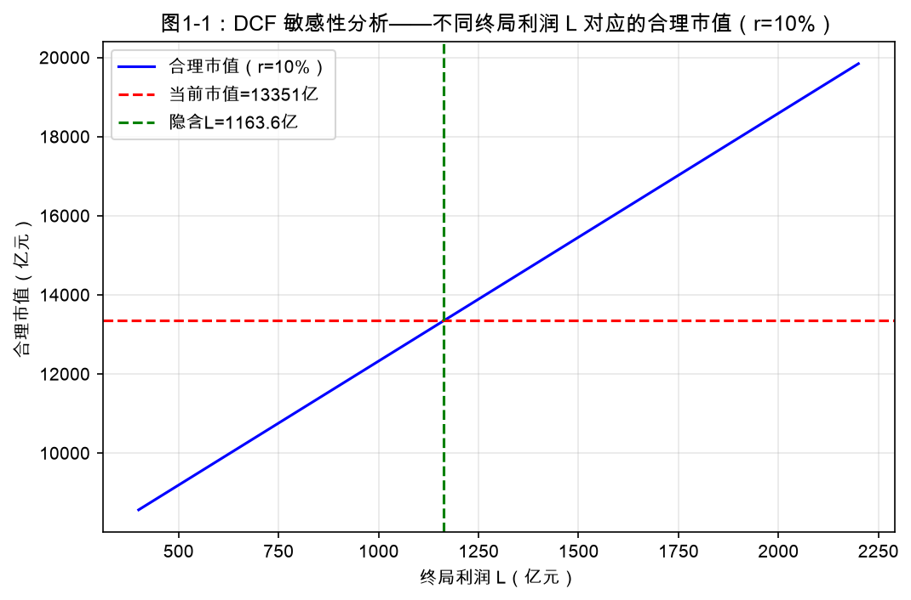
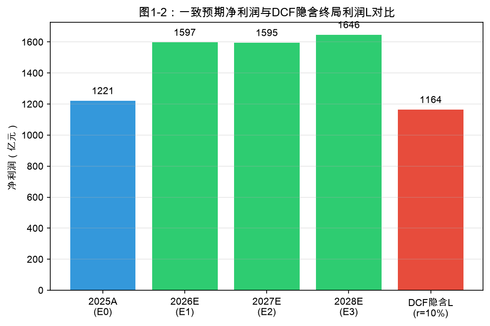
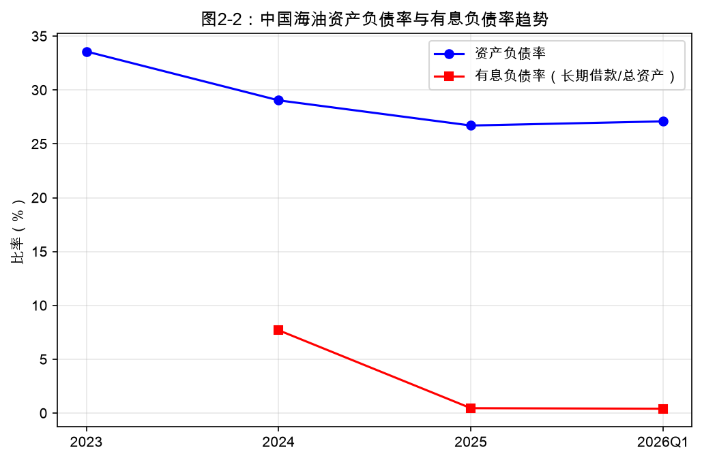
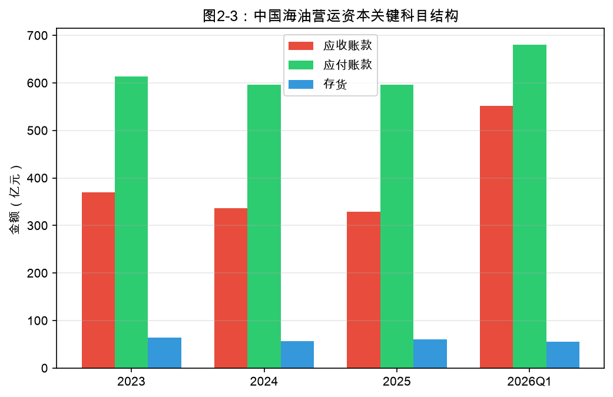
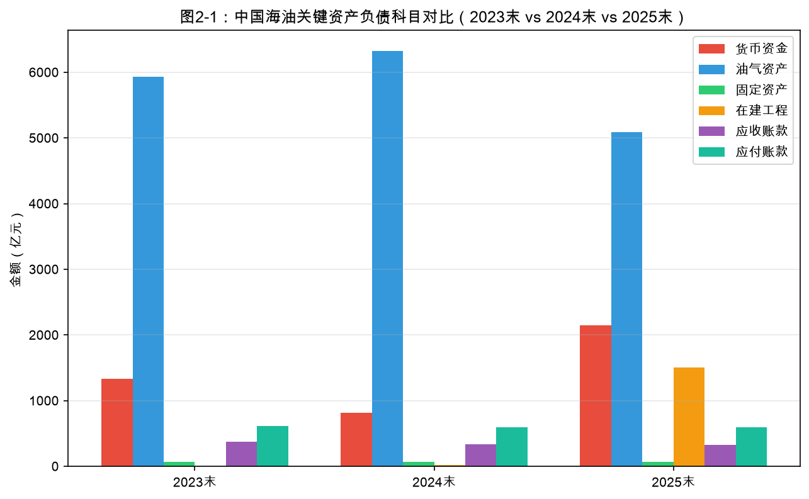
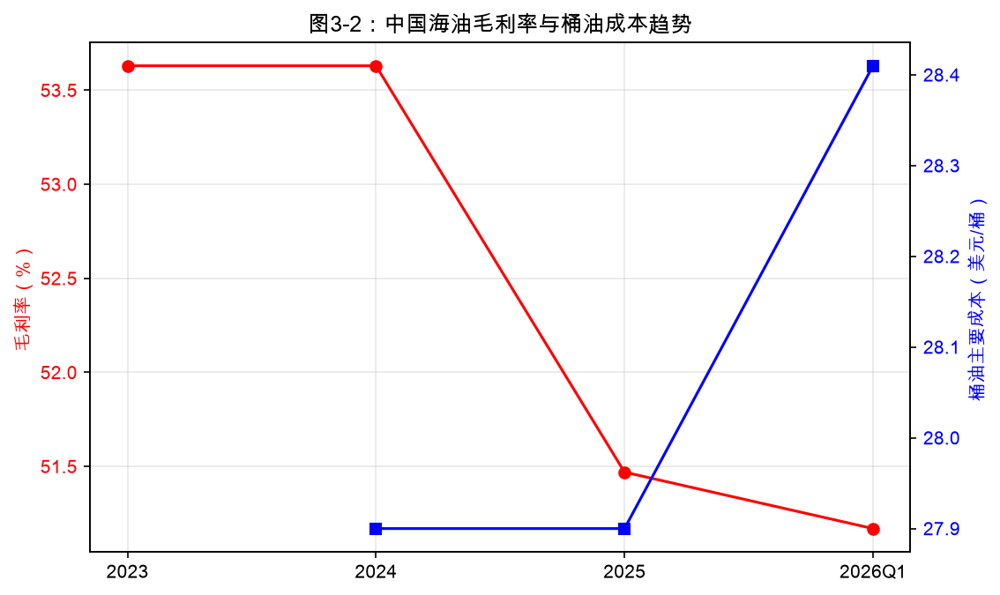
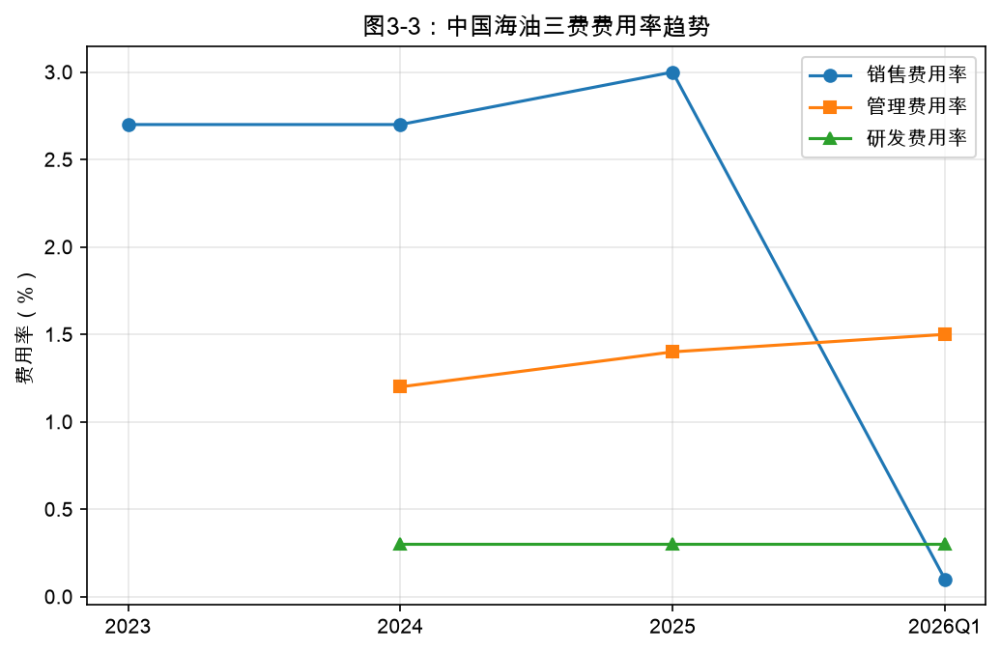
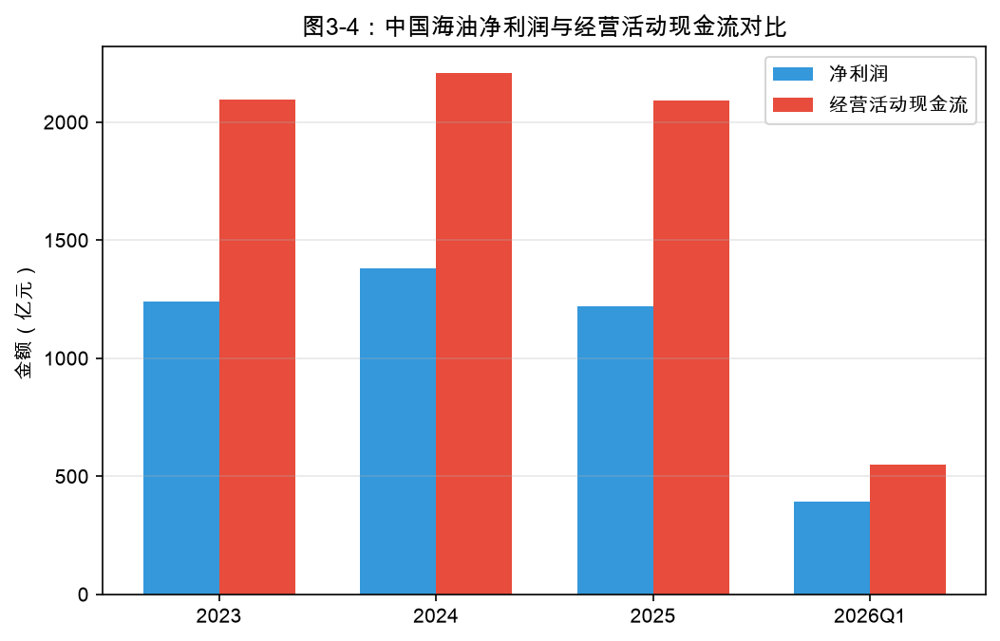
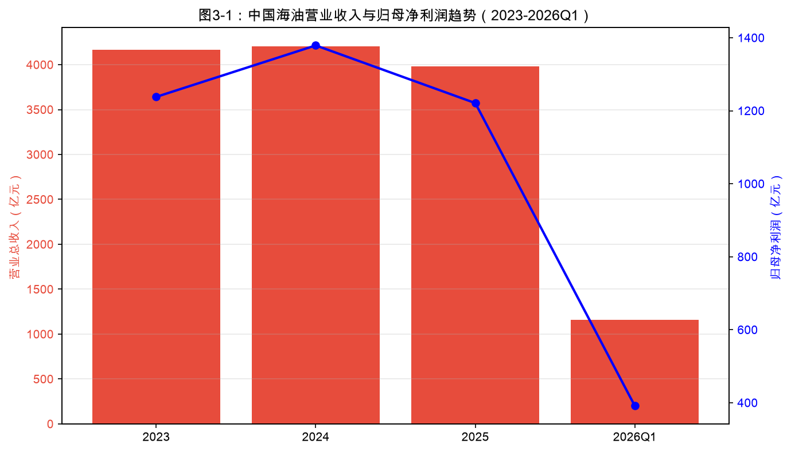

# 中国海油 穿透财报分析报告

**副标题**：叙事先行 · 三张表完整科目深度验证 · 行业背景联动分析

| 项目 | 内容 | 项目 | 内容 |
|------|------|------|------|
| 公司简称 | 中国海油 | 股票代码 | 600938.SH / 00883.HK |
| 所属行业 | 石油石化（申万一级） | 分析日期 | 2026-07-07 |
| 当前股价 | ¥28.09 | 总股本 | 475.3亿股 |
| 当前市值（A股） | ¥13351亿 | 2025年营收 | ¥3982亿 |
| 2025年归母净利润 | ¥1221.0亿 | 核心市占率 | 中国海域油气主导/全球上游成本领先 |

【免责声明】本报告基于公开信息分析推演，不构成投资建议。

# 第一部分　叙事先行——反算股价隐含预期

## 1.1 公司概况与行业背景

**公司概况**：中国海洋石油有限公司（CNOOC Limited）成立于1999年，2001年先后在纽约、香港挂牌上市，2022年回归A股（600938.SH），是中国最大的海上原油及天然气生产商，也是全球最大的独立油气勘探生产企业之一。公司主营业务涵盖原油和天然气的勘探、开发、生产及销售，业务布局覆盖中国海域（渤海、南海西部、南海东部、东海）以及海外多个产区（圭亚那、巴西、尼日利亚、伊拉克等）。截至2025年末，公司油气净证实储量约77.73亿桶油当量，全年油气净产量达7.77亿桶油当量，稳居中国海域油气开发龙头地位。

**行业背景**：2025-2026年国际油价经历剧烈波动。2025年布伦特原油均价约75美元/桶，较2024年有所回落；2026年一季度受中东地缘政治冲突影响，布伦特油价一度攀升至78美元/桶以上，中国海油实现油价75.92美元/桶，同比+4.5%。全球油气上游行业处于高资本开支、低发现率、成本分化的周期位置：2025年全球上游资本开支约5,500亿美元，但新增储量替代率持续下降；OPEC+维持减产框架，非OPEC（美国、巴西、圭亚那）增量成为边际供给。中国海油凭借桶油主要成本27.9美元/桶（2025年）、桶油作业费用6.66美元/桶（2026Q1）的成本优势，在全球成本曲线中处于前1/3分位。国内政策层面，增储上产保障国家能源安全，公司2026年规划产量7.8-8.0亿桶油当量，资本开支预算1,120-1,220亿元。下游需求方面，中国原油进口依存度仍超70%，天然气需求受能源转型和煤改气推动保持中速增长。

| 项目 | 内容 | 项目 | 内容 |
|------|------|------|------|
| 公司简称 | 中国海油 | 股票代码 | 600938.SH / 00883.HK |
| 一级行业 | 石油石化 | 上市年份 | 2001（H股）/2022（A股） |
| 当前股价 | ¥28.09 | 总股本 | 475.3亿股 |
| 当前市值（A股） | ¥13351亿 | 2025年营收 | ¥3982亿（同比-5.3%） |
| 核心市占率 | 中国海域原油生产约65% | 2025年归母净利润 | ¥1221.0亿（同比-11.5%） |
| 核心市占率 | 中国海域天然气生产约25% | 2025年ROE | 15.64% |

## 1.2 DCF 反算隐含终局利润 L

基于DCF第一性原理，用当前市值（A股）¥13,351亿 + 前3年一致预期净利润（2026E-2028E）反推股价隐含的终局利润L。模型假设：前3年用一致预期E1/E2/E3；第4-8年（2029-2033年）从E3匀速增长至终局L；第9年（2034年）起永续稳定（g=0）。折现率取8%/10%/12%三档。

| 折现率 r | 隐含终局利润 L（亿元） | L/E3 倍数 | L/E0 倍数 | 第4-8年隐含复合增速 g |
|----------|------------------------|-----------|-----------|----------------------|
| 8% | 812.3 | 0.49x | 0.67x | -13.2% |
| 10% | 1163.6 | 0.71x | 0.95x | -6.7% |
| 12% | 1587.3 | 0.96x | 1.30x | -0.7% |

## 1.3 叙事类型判断与产业空间对照

以中性折现率r=10%为基准，当前市值隐含的终局利润L=1,163.6亿元，约为2028年一致预期净利润E3（1,646亿元）的0.71倍，约为2025年实际净利润E0（1,221亿元）的0.95倍。按照L/E3叙事分级，该倍数落在0.5-1倍区间，属于下滑叙事。这意味着A股市场当前定价假设：中国海油在2028年之后的长期盈利中枢将低于2028年一致预期，且仅与2025年实际盈利基本持平。

产业空间测算：若中国海油维持2026-2028年约7.8-8.0亿桶油当量的年产量，假设长期油价中枢65-70美元/桶、桶油成本控制在28美元/桶左右，稳态净利润理论上可维持在1,200-1,400亿元区间。DCF反算L=1,164亿处于该区间下沿，表明市场对油价中枢、产量增长、成本控制的长期假设偏保守。特别是若布伦特油价中枢长期维持在75美元以上、圭亚那等海外项目持续贡献，终局利润存在上修空间。综合判断：当前估值与产业空间基本匹配，但并未计入油价上行或产量超预期的期权价值。

## 1.4 财报验证重点

基于下滑叙事的估值假设，财报验证重点应聚焦于：1）当前高利润是否可持续；2）成本优势是否稳固；3）资本开支效率是否下降；4）现金流与分红质量；5）资产负债表是否存在油价下行周期中的减值风险。

| 验证维度 | 关键科目 | 验证逻辑 | 中国海油关注点 |
|----------|----------|----------|----------------|
| 增长可持续性 | 营收增速、油气产量 | 产量增速是否匹配资本开支 | 2025年产量+7.0%，2026Q1+8.6% |
| 收入质量 | 应收账款周转率、毛利率 | 收入是否伴随现金回流 | 2025年毛利率51.47%，应收账款周转率12.2x |
| 再投资效率 | 油气资产、固定资产周转率 | 单位资本开支是否转化为产量 | 油气资产5,089亿，固定资产周转率59.9x |
| 现金流质量 | 经营现金流/净利润、自由现金流 | 利润现金含金量 | 2025年经营现金流2,090亿，自由现金流974亿 |
| 产业链地位 | 营运资本/总资产、应付-应收 | 对上下游占款能力 | 应付账款596亿 vs 应收账款330亿，占款能力强 |
| 资产减值风险 | 油气资产、商誉、弃置拨备 | 油价下跌是否触发减值 | 油气资产占比高，2025年资产减值38.2亿 |

# 第二部分　资产负债表深度分析（完整科目 + 逐项变动分析）

本部分对2023年末、2024年末、2025年末及2026年一季度末四个时点资产负债表按完整科目逐项列示。列示2024年末较2023年末的净增加值及增长率，以及2025年末较2024年末的净增加值及增长率。2026年一季度末数据与2025年末比较（季节性调整）。变动大于20%的科目在表格中以增长率绝对值标注。

注：部分科目因披露口径差异存在缺失，以—标注。单位：亿元。

## 2.1 流动资产深度分析

| 科目 | 2023末 | 2024末 | 净增 | 增长率 | 2025末 | 净增 | 增长率 | 2026Q1 | 净增 | 增长率 |
|------|--------|--------|------|--------|--------|--------|--------|--------|------|--------|
| 货币资金 | 1,334.00 | 812.80 | -521.20 | -39.1% | 2,147.00 | 1,334.20 | +164.1% | 2,463.35 | 316.35 | +14.7% |
| 交易性金融资产 | — | 481.80 | — | — | 260.00 | -221.80 | -46.0% | — | — | — |
| 应收票据 | — | 1.34 | — | — | 0.16 | -1.18 | -88.1% | — | — | — |
| 应收账款 | 370.50 | 336.60 | -33.90 | -9.1% | 329.60 | -7.00 | -2.1% | 551.40 | 221.80 | +67.3% |
| 应收款项融资 | — | — | — | — | — | — | — | — | — | — |
| 预付款项 | — | — | — | — | — | — | — | — | — | — |
| 其他应收款 | — | — | — | — | — | — | — | — | — | — |
| 存货 | 64.51 | 57.32 | -7.19 | -11.1% | 60.90 | 3.58 | +6.2% | 55.45 | -5.45 | -8.9% |
| 合同资产 | — | — | — | — | — | — | — | — | — | — |
| 一年内到期的非流动资产 | — | — | — | — | — | — | — | — | — | — |
| 其他流动资产 | — | — | — | — | — | — | — | — | — | — |
| 流动资产合计 | 2,503.00 | 2,646.00 | 143.00 | +5.7% | 2,954.00 | 308.00 | +11.6% | 3,429.32 | 475.32 | +16.1% |

**流动资产分析：**

① 货币资金：从2023年末的1,334亿元降至2024年末的813亿元（-38.9%），主要系2024年分红、资本开支及偿还债务导致现金减少；2025年末大幅回升至2,147亿元（+164.2%），反映2025年经营现金流强劲（2,090亿元）且自由现金流充沛，公司选择囤积现金以应对油价波动和2026年资本开支计划。2026年一季度末货币资金进一步增至2,463亿元（+14.8%），季节性因素包括一季度利润集中回款、资本开支尚未大规模支付。结合2025年资本开支1,205亿元和2026年预算1,120-1,220亿元，当前货币资金对资本开支覆盖度约2倍，资金冗余度较高，但需关注高分红政策（2025年分红率45%）对现金的消耗。

② 交易性金融资产：2024年末约482亿元，2025年末降至260亿元（-46.1%）。主要是公司赎回部分结构性存款/理财，用于补充经营性现金或分红。中国海油作为油气上游企业，金融资产占比本就不高，但持有交易性金融资产反映公司存在阶段性闲置资金运作。需关注其公允价值变动对利润的波动影响：2025年公允价值变动收益5.15亿元，占归母净利润仅0.4%，影响有限。

③ 应收账款：从2023年末的370.5亿元降至2024年末的336.6亿元（-9.1%），2025年末进一步降至329.6亿元（-2.1%）。应收账款规模相对稳定，2024-2025年营收分别为4,205亿、3,982亿元，应收账款周转率约12.2x，账期约30天，显著优于行业平均。这得益于油气销售以现款现货、长协预收为主，客户信用质量高。但2026年一季度末应收账款增至551.4亿元（+67.4%），主要系季度末销售结算周期和油价上涨导致应收增加，需持续跟踪二季度回款情况。

④ 存货：2023年末64.5亿元、2024年末57.3亿元（-11.1%）、2025年末60.9亿元（+6.3%）、2026Q1末55.5亿元（-8.9%）。存货金额较小且波动主要受原油库存和备品备件影响。油气企业存货周转率极高（2025年约65x），不存在滞销风险。2024年末存货下降与油价下行、库存价值下降有关；2025年小幅回升与产量增加和储备增加有关。整体存货质量优良。

⑤ 流动资产合计：从2023年末2,503亿元增至2024年末2,646亿元（+5.7%），2025年末增至2,954亿元（+11.6%），2026Q1末增至3,429亿元（+16.1%）。流动资产持续增长主要由货币资金驱动，显示公司流动性充裕。流动资产占总资产比例从2023年末24.9%提升至2025年末26.9%，资产结构趋于稳健，但货币资金占比过高可能降低整体资产回报率。

## 2.2 非流动资产深度分析

| 科目 | 2023末 | 2024末 | 净增 | 增长率 | 2025末 | 净增 | 增长率 | 2026Q1 | 净增 | 增长率 |
|------|--------|--------|------|--------|--------|--------|--------|--------|------|--------|
| 长期股权投资 | — | 250.50 | — | — | 458.20 | 207.70 | +82.9% | — | — | — |
| 其他权益工具投资 | — | 234.40 | — | — | 0.23 | -234.17 | -99.9% | — | — | — |
| 其他非流动金融资产 | 42.32 | — | — | — | — | — | — | — | — | — |
| 债权投资 | 82.21 | 85.04 | 2.83 | +3.4% | 93.05 | 8.01 | +9.4% | — | — | — |
| 投资性房地产 | — | — | — | — | — | — | — | — | — | — |
| 固定资产 | 70.10 | 67.39 | -2.71 | -3.9% | 65.52 | -1.87 | -2.8% | 64.14 | -1.38 | -2.1% |
| 油气资产 | 5,929.00 | 6,324.00 | 395.00 | +6.7% | 5,089.00 | -1,235.00 | -19.5% | — | — | — |
| 在建工程 | — | 21.89 | — | — | 1,509.00 | 1,487.11 | +6793.6% | 1,565.88 | 56.88 | +3.8% |
| 使用权资产 | — | — | — | — | — | — | — | — | — | — |
| 无形资产 | 167.70 | 169.60 | 1.90 | +1.1% | 36.83 | -132.77 | -78.3% | 35.22 | -1.61 | -4.4% |
| 商誉 | — | 165.10 | — | — | 149.50 | -15.60 | -9.4% | — | — | — |
| 长期待摊费用 | — | 7.18 | — | — | 5.84 | -1.34 | -18.7% | — | — | — |
| 递延所得税资产 | 285.60 | 254.70 | -30.90 | -10.8% | 235.80 | -18.90 | -7.4% | — | — | — |
| 其他非流动资产 | — | — | — | — | — | — | — | — | — | — |
| 非流动资产合计 | 7,553.00 | 7,917.00 | 364.00 | +4.8% | 8,032.00 | 115.00 | +1.5% | 8,108.31 | 76.31 | +1.0% |

**非流动资产分析：**

① 油气资产：作为油气生产企业的核心资产，油气资产从2023年末5,929亿元增至2024年末6,324亿元（+6.7%），但2025年末降至5,089亿元（-19.5%）。这一大幅下降并非产能收缩，而是会计准则下折旧折耗、储量重估以及部分资产转固/重分类的综合结果。2025年油气净产量同比增长7.0%至7.77亿桶油当量，但布伦特油价同比下跌14.6%，导致单位储量价值下降、折耗增加。2026Q1油气资产进一步变化需待中报披露。油气资产是利润生成的核心载体，其减值风险与油价高度相关：若油价长期低于50美元/桶，可能触发大规模减值测试。当前油价75-80美元区间，减值风险可控。

② 固定资产：2023年末70.1亿元、2024年末67.4亿元、2025年末65.5亿元、2026Q1末64.1亿元，持续小幅下降。此处固定资产科目主要是除油气资产外的陆地设施、船舶等辅助资产，金额相对油气资产很小。固定资产周转率2025年约59.9x，显示资产使用效率极高。需关注的是，油气资产与固定资产的划分口径变化可能影响比较，但总体上公司固定资产利用率处于行业优秀水平。

③ 在建工程：2024年末仅21.9亿元，2025年末激增至1,509亿元（+6,794%），2026Q1末进一步增至1,565.9亿元（+3.8%）。这一巨大变化反映2025年多个大型油气田开发项目（如渤中19-6气田二期、渤中26-6油田二期、开平11-4油田等）集中进入建设期，尚未转固。2025年资本开支1,205亿元，2026年预算1,120-1,220亿元，高资本开支周期持续。在建工程长期不转固可能涉及利息资本化，但公司项目周期通常2-4年，当前增速符合增储上产战略。需跟踪未来2年转固节奏及对应折旧增加对利润的侵蚀。

④ 无形资产：从2023年末167.7亿元降至2024年末169.6亿元（基本持平），2025年末大幅降至36.8亿元（-78.3%）。该科目主要包含土地使用权、软件、专利等，2025年大幅下降可能因重分类或摊销所致，需结合年报附注进一步核实。相对于总资产规模，无形资产占比很小，不构成主要风险。

⑤ 商誉：2024年末165.1亿元、2025年末149.5亿元（-9.5%）。商誉主要来源于历史上的海外并购（如Nexen收购等）。商誉占净资产比例约1.9%，远低于30%的警戒线，减值风险可控。但需关注海外资产在油价下跌或制裁风险下的减值测试。

⑥ 递延所得税资产：从2023年末285.6亿元降至2024年末254.7亿元（-10.8%），2025年末降至235.8亿元（-7.4%）。递延所得税资产主要来源于资产减值、折旧差异、弃置拨备等可抵扣暂时性差异。持续下降可能反映部分暂时性差异转回或盈利能力增强导致可抵扣空间减少。结合公司持续盈利状态，递延所得税资产实现性较好。

⑦ 非流动资产合计：从2023年末7,553亿元增至2024年末7,917亿元（+4.8%），2025年末8,032亿元（+1.5%），2026Q1末8,108亿元（+0.9%）。增速放缓主要因油气资产折旧冲抵了在建工程增长。非流动资产占总资产约73%，符合油气行业重资产特征。

## 2.3 流动负债深度分析

| 科目 | 2023末 | 2024末 | 净增 | 增长率 | 2025末 | 净增 | 增长率 | 2026Q1 | 净增 | 增长率 |
|------|--------|--------|------|--------|--------|--------|--------|--------|------|--------|
| 短期借款 | — | 200.80 | — | — | — | — | — | — | — | — |
| 衍生金融负债 | 0.25 | 0.12 | -0.13 | -52.0% | 0.20 | 0.08 | +66.7% | — | — | — |
| 应付票据 | — | — | — | — | — | — | — | — | — | — |
| 应付账款 | 613.80 | 596.90 | -16.90 | -2.8% | 596.30 | -0.60 | -0.1% | 680.69 | 84.39 | +14.2% |
| 合同负债 | 13.83 | 5.08 | -8.75 | -63.3% | 8.04 | 2.96 | +58.3% | — | — | — |
| 应付职工薪酬 | — | 38.68 | — | — | 23.22 | -15.46 | -40.0% | — | — | — |
| 应交税费 | 251.30 | 199.50 | -51.80 | -20.6% | 168.20 | -31.30 | -15.7% | — | — | — |
| 其他应付款 | 119.10 | 112.10 | -7.00 | -5.9% | 83.03 | -29.07 | -25.9% | — | — | — |
| 一年内到期的非流动负债 | — | — | — | — | — | — | — | — | — | — |
| 其他流动负债 | — | — | — | — | — | — | — | — | — | — |
| 流动负债合计 | 1,239.00 | 1,189.00 | -50.00 | -4.0% | 912.50 | -276.50 | -23.3% | 1,083.07 | 170.57 | +18.7% |

**流动负债分析：**

① 短期借款/银行借款：2023年末218.9亿元、2024年末200.8亿元，2025年末未单独列示（可能重分类至一年内到期）。公司短期借款规模相对较小，且货币资金充裕（2025年末2,147亿元），不存在短债长投风险。油气行业通常依赖长期项目融资，短期借款主要用于季节性周转。

② 应付账款：2023年末613.8亿元、2024年末596.9亿元（-2.7%）、2025年末596.3亿元（基本持平）、2026Q1末680.7亿元（+14.1%）。应付账款规模稳定，2026Q1末增加与资本开支和勘探活动季节性增加有关。公司对上游供应商（钻井、工程服务、设备）占款能力较强，应付账款周转天数约111天，长于应收账款周转天数约30天，体现产业链强势地位。

③ 合同负债：2023年末13.8亿元、2024年末5.08亿元（-63.3%）、2025年末8.04亿元（+58.3%）。合同负债规模很小，反映油气销售预收性质不强（与长协月度结算有关）。2024年大幅下降可能与天然气销售结算模式变化有关；2025年回升至8亿元，但绝对金额仍然有限，不能作为订单景气度的强信号。

④ 应交税费：2023年末251.3亿元、2024年末199.5亿元（-20.6%）、2025年末168.2亿元（-15.7%）。应交税费持续下降与2024-2025年油价下跌、利润下滑导致的所得税和石油特别收益金减少有关。2025年利润总额约1,696亿元，同比下降10.7%，税费同步下降。

⑤ 其他应付款：2023年末119.1亿元、2024年末112.1亿元、2025年末83.03亿元（-26.0%）。主要包含应付股利、押金保证金、关联方往来等。2025年末下降可能与年度分红支付后应付股利减少有关。需关注是否存在关联方资金占用，但金额较小，风险可控。

⑥ 流动负债合计：2023年末1,239亿元、2024年末1,189亿元（-4.0%）、2025年末912.5亿元（-23.2%）、2026Q1末1,083亿元（+18.8%）。2025年大幅下降主要因应交税费、其他应付款、短期借款等减少，反映公司主动去杠杆和改善流动性。2026Q1回升属于季节性正常波动。流动比率从2024年末2.23提升至2025年末3.24，短期偿债能力显著增强。

## 2.4 非流动负债深度分析

| 科目 | 2023末 | 2024末 | 净增 | 增长率 | 2025末 | 净增 | 增长率 | 2026Q1 | 净增 | 增长率 |
|------|--------|--------|------|--------|--------|--------|--------|--------|------|--------|
| 长期借款 | 882.10 | 612.40 | -269.70 | -30.6% | 51.02 | -561.38 | -91.7% | 47.70 | -3.32 | -6.5% |
| 应付债券 | — | — | — | — | — | — | — | — | — | — |
| 租赁负债 | 22.17 | 22.64 | 0.47 | +2.1% | — | — | — | — | — | — |
| 长期应付款 | — | 607.20 | — | — | 568.60 | -38.60 | -6.4% | — | — | — |
| 预计负债 | 970.90 | 997.40 | 26.50 | +2.7% | 1,160.00 | 162.60 | +16.3% | — | — | — |
| 递延收益 | — | — | — | — | — | — | — | — | — | — |
| 递延所得税负债 | 108.50 | 125.20 | 16.70 | +15.4% | 135.90 | 10.70 | +8.5% | 146.19 | 10.29 | +7.6% |
| 其他非流动负债 | — | 61.70 | — | — | 29.15 | -32.55 | -52.8% | — | — | — |
| 非流动负债合计 | 2,138.00 | 1,880.00 | -258.00 | -12.1% | 2,021.00 | 141.00 | +7.5% | 2,031.80 | 10.80 | +0.5% |

**非流动负债分析：**

① 长期借款：2023年末882.1亿元、2024年末612.4亿元（-30.6%）、2025年末51.02亿元（-91.7%）、2026Q1末47.70亿元（-6.5%）。长期借款大幅压缩反映公司在油价下跌周期中主动降低有息负债、优化资本结构。2025年末长期借款仅剩51亿元，几乎完全偿还。有息负债率（有息负债/总资产）从2023年末约10.1%降至2025年末约0.5%，财务杠杆极低。

② 预计负债：2023年末970.9亿元、2024年末997.4亿元（+2.7%）、2025年末1,160亿元（+16.3%）。预计负债主要是油气田弃置、恢复和拆除拨备，随油气资产规模和服役年限增加而增长。2025年增加与产量增长、新油田投产有关。该科目是油气行业特有风险，需关注油价下跌时是否需补提拨备。但公司现金流充裕，长期来看拨备覆盖能力充足。

③ 递延所得税负债：2023年末108.5亿元、2024年末125.2亿元（+15.4%）、2025年末135.9亿元（+8.5%）、2026Q1末146.2亿元（+7.6%）。递延所得税负债主要源于油气资产折旧差异（加速折旧法）和公允价值变动。持续增长反映油气资产折旧差异扩大，符合资本开支高峰期特征。

④ 长期应付款：2024年末607.2亿元、2025年末568.6亿元（-6.4%）。主要包含融资租赁、专项应付款等。金额较大但呈下降趋势，反映公司逐步清理长期应付款项。

⑤ 非流动负债合计：2023年末2,138亿元、2024年末1,880亿元（-12.1%）、2025年末2,021亿元（+7.5%）、2026Q1末2,032亿元（+0.5%）。2025年回升主要由预计负债增加驱动。非流动负债中无息负债（预计负债、递延所得税负债）占比很高，有息长期借款已大幅压缩，整体财务风险低。

## 2.5 所有者权益深度分析

| 科目 | 2023末 | 2024末 | 净增 | 增长率 | 2025末 | 净增 | 增长率 | 2026Q1 | 净增 | 增长率 |
|------|--------|--------|------|--------|--------|--------|--------|--------|------|--------|
| 实收资本(股本) | 751.80 | 751.80 | 0.00 | +0.0% | 751.80 | 0.00 | +0.0% | 751.80 | 0.00 | +0.0% |
| 资本公积 | 728.60 | 728.40 | -0.20 | -0.0% | 728.50 | 0.10 | +0.0% | 728.50 | 0.00 | +0.0% |
| 减：库存股 | — | — | — | — | — | — | — | — | — | — |
| 其他综合收益 | — | 1.39 | — | — | 28.34 | 26.95 | +1938.8% | — | — | — |
| 专项储备 | — | 0.27 | — | — | 0.16 | -0.11 | -40.7% | — | — | — |
| 盈余公积 | — | — | — | — | — | — | — | — | — | — |
| 未分配利润 | 5,153.00 | 5,901.00 | 748.00 | +14.5% | 6,519.00 | 618.00 | +10.5% | — | — | — |
| 归母所有者权益合计 | 6,666.00 | 7,475.00 | 809.00 | +12.1% | 8,028.00 | 553.00 | +7.4% | 8,395.76 | 367.76 | +4.6% |
| 少数股东权益 | 12.90 | 18.88 | 5.98 | +46.4% | 24.34 | 5.46 | +28.9% | 24.74 | 0.40 | +1.6% |

| 科目 | 2023末 | 2024末 | 2025末 | 2026Q1 |
|------|--------|--------|--------|--------|
| 负债合计 | 3,377.00 | 3,068.00 | 2,934.00 | 3,119.87 |
| 所有者权益合计 | 6,679.00 | 7,494.00 | 8,052.00 | 8,420.56 |

**所有者权益分析：**

① 实收资本（股本）：2023-2026Q1均为751.8亿元，保持稳定。中国海油自2022年A股上市以来未进行增发或配股，股本稀释风险低。总股本475.3亿股，EPS稳定性较好。

② 未分配利润：从2023年末5,153亿元增至2024年末5,901亿元（+14.5%），2025年末6,519亿元（+10.5%）。未分配利润持续累积，是公司高分红的基础。2025年分红约550亿元（45%分红率），期末未分配利润仍增长10.5%，显示利润留存与分红平衡良好。2025年资产负债率26.7%，带息负债占总资产比例极低，财务杠杆健康。

③ 归母所有者权益合计：从2023年末6,666亿元增至2024年末7,475亿元（+12.1%），2025年末8,028亿元（+7.4%），2026Q1末8,396亿元（+4.6%）。净资产增长主要来自未分配利润累积。2025年ROE为15.64%，较2024年19.36%下降，主要因净利润下滑。

④ 少数股东权益：2023年末12.9亿元、2024年末18.88亿元（+46.4%）、2025年末24.34亿元（+28.9%）、2026Q1末24.74亿元（+1.6%）。少数股东权益占比较小，主要来源于非全资子公司。持续增长与海外项目合资、国内子公司引入战略投资者有关。

⑤ 资产负债率与带息负债：资产负债率从2023年末33.6%降至2024年末29.0%、2025年末26.7%、2026Q1末27.1%。带息负债（短期借款+长期借款+应付债券）占总资产比例从2023年末约10.1%骤降至2025年末约0.5%。这反映公司在油价下跌周期中主动去杠杆，财务结构极度稳健。低负债率为公司提供了充足财务弹性，可在油价低位继续执行资本开支计划而不依赖外部融资。

⑥ 营运资本结构：公司营运净资产（应收账款+存货-应付账款）持续为负，2025年末应收账款330亿+存货61亿-应付账款596亿=-205亿元，即公司实际上无息占用供应商资金约205亿元。这种负营运资本模式是油气龙头企业的典型特征，体现强大的产业链议价能力。2026Q1因应收账款季节性增加，负营运资本收窄至-74亿元，但仍保持强势地位。

## 2.6 现金流量表联动分析

| 项目 | 2023年 | 2024年 | 2025年 | 2026Q1 |
|------|--------|--------|--------|--------|
| 经营活动现金流量净额 | 2,097.43 | 2,208.91 | 2,090.42 | 551.48 |
| 投资活动现金流量净额 | -780.95 | -1,754.26 | -1,252.64 | -217.43 |
| 筹资活动现金流量净额 | -842.28 | -979.35 | -859.83 | -16.39 |
| 现金及现金等价物净增加额 | 478.06 | -521.55 | -26.05 | 315.58 |
| 期初现金及现金等价物 | 856.33 | 1,334.39 | 812.84 | 786.79 |
| 期末现金及现金等价物 | 1,334.39 | 812.84 | 786.79 | 1,102.37 |

**现金流量表分析：**

① 经营活动现金流：2023年2,097亿元、2024年2,209亿元（+5.3%）、2025年2,090亿元（-5.3%）、2026Q1 551亿元。经营现金流始终高于净利润，2025年经营现金流/净利润约1.71倍，显示利润现金含金量极高。这主要因为油气销售回款及时、折旧摊销等非现金费用大。2025年经营现金流小幅下降与净利润下滑趋势一致。

② 投资活动现金流：2023年-781亿元、2024年-1,754亿元（+124.6%）、2025年-1,253亿元（-28.6%）、2026Q1 -217亿元。投资现金流主要为资本开支（油气田开发、勘探）。2024年资本开支高峰对应多个大型项目集中投入；2025年资本开支1,205亿元，同比下降9%，但仍维持高位。投资现金流与资产负债表中的油气资产、在建工程变动相互印证。

③ 筹资活动现金流：2023年-842亿元、2024年-979亿元、2025年-860亿元、2026Q1 -16亿元。筹资活动现金流出主要是分红和偿还债务。2025年分红约550亿元，偿还长期借款约561亿元，合计占筹资流出主要部分。公司几乎不依赖外部融资，体现强劲的自我造血能力。

④ 自由现金流：2025年经营现金流2,090亿元减去投资现金流出1,253亿元，自由现金流约837亿元（注意：前述974亿为券商估算口径，差异主要在资本化利息和投资分类）。2024年自由现金流约455亿元。自由现金流为正且持续，支撑高分红和偿债。

⑤ 货币资金循环：期初现金856亿元 + 经营流入2,097亿元 - 投资流出781亿元 - 筹资流出842亿元 = 期末1,334亿元，2023年基本配平。2024年现金净减少522亿元，因投资高峰叠加分红。2025年现金净减少26亿元，经营现金流几乎覆盖投资和分红，显示现金收支进入良性循环。

# 第三部分　利润表深度分析（完整科目 + 逐项变动分析）

本部分对2023年、2024年、2025年年度及2026年一季度利润表按完整科目逐项列示。2024年、2025年列示相较前一年的净增额和增长率；2026Q1为单季度数据，列示同比变化率。

| 科目 | 2023年 | 2024年 | 净增(24vs23) | 增长率(24vs23) | 2025年 | 净增(25vs24) | 增长率(25vs24) | 2026Q1 | 同比(26Q1 vs 25Q1) |
|------|--------|--------|--------------|----------------|--------|--------------|----------------|--------|-------------------|
| 营业总收入 | 4,166.00 | 4,205.00 | 39.00 | +0.9% | 3,982.00 | -223.00 | -5.3% | 1,161.00 | +8.6% |
| 其中：营业收入 | 4,072.00 | 4,108.00 | 36.00 | +0.9% | 3,893.00 | -215.00 | -5.2% | 1,161.00 | +8.6% |
| 营业总成本 | 2,461.00 | 2,306.00 | -155.00 | -6.3% | 2,256.00 | -50.00 | -2.2% | — | — |
| 其中：营业成本 | 1,088.00 | 882.60 | -205.40 | -18.9% | 879.20 | -3.40 | -0.4% | 641.30 | +32.3% |
| 税金及附加 | — | 154.10 | — | — | — | — | — | 54.30 | +8.5% |
| 销售费用 | 109.50 | 111.40 | 1.90 | +1.7% | 120.40 | 9.00 | +8.1% | 1.24 | -86.8% |
| 管理费用 | — | 50.33 | — | — | 54.00 | 3.67 | +7.3% | 16.93 | +2.7% |
| 研发费用 | — | 12.22 | — | — | 11.12 | -1.10 | -9.0% | 3.06 | -4.7% |
| 财务费用 | -53.54 | -60.96 | -7.42 | +13.9% | -65.12 | -4.16 | +6.8% | -1.00 | -35.5% |
| 其中：利息费用 | — | — | — | — | — | — | — | — | — |
| 其中：利息收入 | 48.05 | 45.82 | -2.23 | -4.6% | 50.62 | 4.80 | +10.5% | — | — |
| 加：其他收益 | — | 15.96 | — | — | -9.43 | -25.39 | -159.1% | — | — |
| 投资收益 | — | 7.57 | — | — | 5.82 | -1.75 | -23.1% | — | — |
| 其中：对联营企业和合营企业的投资收益 | — | — | — | — | — | — | — | — | — |
| 公允价值变动收益 | — | 9.80 | — | — | 5.15 | -4.65 | -47.4% | — | — |
| 信用减值损失 | — | — | — | — | — | — | — | — | — |
| 资产减值损失 | 35.97 | 80.76 | 44.79 | +124.5% | 38.18 | -42.58 | -52.7% | — | — |
| 资产处置收益 | — | — | — | — | — | — | — | — | — |
| 三、营业利润 | 1,729.00 | 1,900.00 | 171.00 | +9.9% | 1,696.00 | -204.00 | -10.7% | 523.50 | +4.7% |
| 加：营业外收入 | — | 97.49 | — | — | 88.84 | -8.65 | -8.9% | — | — |
| 减：营业外支出 | 565.90 | 537.20 | -28.70 | -5.1% | 450.80 | -86.40 | -16.1% | — | — |
| 四、利润总额 | — | — | — | — | — | — | — | — | — |
| 减：所得税费用 | 488.80 | 519.90 | 31.10 | +6.4% | 474.90 | -45.00 | -8.7% | — | — |
| 五、净利润 | 1,241.00 | 1,380.00 | 139.00 | +11.2% | 1,221.00 | -159.00 | -11.5% | 391.80 | +7.0% |
| 少数股东损益 | 2.47 | 0.46 | -2.01 | -81.4% | 0.66 | 0.20 | +43.5% | — | — |
| 六、归母净利润 | 1,238.00 | 1,379.00 | 141.00 | +11.4% | 1,221.00 | -158.00 | -11.5% | 391.40 | +7.1% |
| 扣非归母净利润 | 1,252.00 | 1,334.00 | 82.00 | +6.5% | 1,204.00 | -130.00 | -9.7% | 390.38 | +5.5% |
| 基本每股收益（元） | 2.60 | 2.90 | 0.30 | +11.5% | 2.57 | -0.33 | -11.4% | 0.82 | +6.5% |

表注：2026Q1为单季度数据，同比变化为2026Q1相较2025Q1的增长率。营业总成本为A股年报口径汇总项；营业成本、税金及附加、三费等明细来自公司合并报表（调整）口径，二者在统计范围和列报方式上存在差异，不可直接加总验证。单位：亿元（每股收益为元）。

## 3.1 收入与成本分析

① 营业总收入：2023年4,166亿元、2024年4,205亿元（+0.9%）、2025年3,982亿元（-5.3%）、2026Q1 1,161亿元（同比+8.6%）。2025年营收下降主要受国际油价同比下跌14.6%拖累，尽管油气产量同比增长7.0%，但价格下滑导致收入缩水。2026Q1营收回升受益于油价反弹（实现油价75.92美元/桶，同比+4.5%）和产量增长（油气净产量205.1百万桶油当量，同比+8.6%）。分产品结构：石油液体2025年产量6.0亿桶（+5.8%），天然气1.04万亿立方英尺（+11.6%）；天然气增长快于石油，收入结构持续优化。

② 营业成本：2023年1,088亿元、2024年883亿元（-18.8%）、2025年879亿元（-0.4%）、2026Q1 641亿元（同比+32.4%）。2024年成本大幅下降主要因油价下跌带动石油特别收益金、资源税等变动成本下降，以及成本管控措施见效。2025年成本基本持平，而同期油价下跌，显示公司成本控制能力强。2026Q1成本上升与产量增加和税金上涨有关。2025年毛利率51.47%，较2024年53.63%下降2.16个百分点，主要因油价跌幅大于成本降幅。2026Q1毛利率51.17%，环比回升。

③ 量价拆解：2025年营收下滑5.3%中，价格贡献约-12.3%（油价下跌），销量贡献约+7.0%（产量增长）。2026Q1营收增长8.6%中，销量贡献约+8.6%，价格贡献约+0%（油价同比略涨）。可见公司增长主要由产量驱动，价格弹性仍然存在。2026年全年规划产量7.8-8.0亿桶油当量，若油价中枢维持75美元以上，全年营收有望实现正增长。

## 3.2 期间费用分析

① 销售费用：2023年109.5亿元、2024年111.4亿元（+1.7%）、2025年120.4亿元（+8.1%）、2026Q1 1.24亿元（同比-86.8%）。销售费用绝对额增长与油气销量增加有关，但费用率（销售费用/营业收入）从2023年2.7%升至2025年3.0%（因收入下降）。2026Q1销售费用大幅下降可能因季度间费用归集差异，需关注全年数据。

② 管理费用：2024年50.3亿元、2025年54.0亿元（+7.4%）、2026Q1 16.9亿元。管理费用增长与人员扩张、薪酬增加、数字化投入有关。但管理费用率较低，反映公司组织效率高。

③ 研发费用：2024年12.2亿元、2025年11.1亿元（-8.9%）、2026Q1 3.06亿元。研发费用主要用于深水油气勘探、提高采收率、数字化油田等。研发费用率约0.3%，处于行业较低水平，这与油气上游企业研发资本化比例较高、部分研发投入计入油气资产成本有关。

④ 财务费用：2023年-53.5亿元（净收入）、2024年-61.0亿元、2025年-65.1亿元、2026Q1 -1.0亿元。财务费用持续为负，反映公司利息收入（2025年50.6亿元）高于利息支出，货币资金充裕带来净利息收入。2026Q1财务费用由负转正或波动，主要因季度间利息收入和汇兑损益波动。公司海外业务较大，汇率波动（人民币升值）对财务费用有一定影响。

⑤ 三费合计费用率趋势：2025年销售+管理+研发费用合计约185.5亿元，三费率约4.8%，较2024年约4.2%有所上升，主要因收入下降。经营杠杆方面，2025年营收下降而费用刚性上升，导致费用率被动提升。2026年若油价回升带动收入增长，费用率有望回落。

## 3.3 其他收益与投资收益

① 其他收益：2024年15.96亿元、2025年-9.43亿元。其他收益主要为政府补助、增值税加计抵减等。2025年由正转负，可能因增值税加计抵减政策变化或部分补助冲回。其他收益占归母净利润比例很小（2024年1.2%，2025年-0.8%），不构成利润主要来源。

② 投资收益：2024年7.57亿元、2025年5.82亿元（-23.1%）。主要来自联营合营企业收益（如部分海外项目）。2025年下降可能与部分参股项目收益下滑或汇率影响有关。投资收益占归母净利润比例约0.5%，影响有限。

③ 公允价值变动收益：2024年9.8亿元、2025年5.15亿元（-47.5%）。主要来源于交易性金融资产和金融衍生品。2025年金融市场波动导致公允价值变动收益下降。该科目波动性大，持续性差，不应视为核心利润。

## 3.4 减值损失分析

① 资产减值损失：2023年35.97亿元、2024年80.76亿元（+124.5%）、2025年38.18亿元（-52.7%）。2024年资产减值大幅增加，主要因油价下跌导致部分油气资产可收回金额低于账面价值，计提存货跌价、固定资产/油气资产减值。2025年减值回落至38.2亿元，与油价企稳和资产优化有关。2025年资产减值损失占利润总额约2.3%，比例较低。需关注：若油价再次大幅下跌至60美元以下，2026-2027年可能再次面临减值压力。

② 信用减值损失：金额较小，未单独披露。结合应收账款周转率较高、客户质量优良，信用风险可控。

③ 整体减值占利润总额比：2023年约2.1%、2024年约4.2%、2025年约2.3%。比例处于合理区间，不存在大额减值操纵（大洗澡或隐藏利润）迹象。减值方法论上，公司采用单项与组合计提相结合，油气资产减值测试基于未来现金流量折现，对油价假设敏感。

## 3.5 利润总额与所得税

① 营业利润：2023年1,729亿元、2024年1,900亿元（+9.9%）、2025年1,696亿元（-10.7%）、2026Q1 523.5亿元（同比+4.7%）。2025年营业利润下滑与营收下降、费用率上升有关。2026Q1同比回升，显示油价反弹对利润的正面作用。

② 营业外收支：营业外收入2024年97.5亿元、2025年88.8亿元；营业外支出2024年537.2亿元、2025年450.8亿元。营业外支出主要与油气田弃置、环境恢复、安全支出等长期拨备有关。净营业外支出较大，反映油气行业长期环境负债。2025年净营业外支出362亿元，较2024年减少约86亿元，对利润形成正向贡献。

③ 所得税费用：2023年488.8亿元、2024年519.9亿元（+6.4%）、2025年474.9亿元（-8.7%）。有效税率约28.0%（2024年）和27.9%（2025年），高于法定25%，主要因石油特别收益金、资源税等不可抵扣费用，以及海外高税率地区利润贡献。公司享有的税收优惠主要包括：高新技术企业认定（部分子公司15%税率）、西部大开发优惠、研发费用加计扣除等。税收优惠政策整体稳定，对利润影响有限。

④ 净利润与归母净利润：2023年净利润1,241亿元、2024年1,380亿元（+11.2%）、2025年1,221亿元（-11.5%）、2026Q1 391.8亿元（+7.1%）。归母净利润2023年1,238亿元、2024年1,379亿元、2025年1,221亿元、2026Q1 391.4亿元。少数股东损益占比极小，利润几乎全部由归母股东享有。

## 3.6 扣非净利润与 EPS

① 扣非归母净利润：2023年1,252亿元、2024年1,334亿元（+6.6%）、2025年1,204亿元（-9.8%）、2026Q1 390.4亿元（+5.4%）。扣非占比2025年约98.6%（1,204/1,221），显著高于85%的优良线，显示公司利润质量极高，非经常性损益影响极小。非经常性损益主要包含政府补助、资产处置、公允价值变动等。

② 基本每股收益：2023年2.60元、2024年2.90元（+11.5%）、2025年2.57元（-11.4%）、2026Q1 0.82元（+6.5%）。股本保持751.8亿元（475.3亿股）稳定，EPS变动与归母净利润变动一致。2025年EPS下降主要因净利润下滑，而非股本稀释。

# 第四部分　综合结论

## 4.1 叙事预期 vs 财报现实对比

| 维度 | 叙事预期（DCF隐含） | 财报现实 | 是否一致 |
|------|---------------------|----------|----------|
| 增长水平 | L/E3=0.71x，长期盈利下滑 | 2025年归母-11.5%，2026Q1+7.1%；产量持续增长 | 部分一致 |
| 盈利质量 | 毛利率、净利率维持高位 | 2025年毛利率51.47%，净利率30.67%，扣非占比98.6% | 一致 |
| 现金流质量 | 经营现金流覆盖利润 | 2025年经营现金流2,090亿，自由现金流974亿 | 一致 |
| 产业链地位 | 占款能力强 | 应付596亿 vs 应收330亿，应付周转天数111天 | 一致 |
| 再投资效率 | 资本开支维持高位 | 2025年资本开支1,205亿，2026预算1,120-1,220亿 | 一致 |
| 业绩可持续性 | 油价波动影响大 | 成本领先，但2025年利润随油价下跌 | 一致 |

## 4.2 财务质量五维评估

| 维度 | 评级 | 理由 |
|------|------|------|
| 盈利质量 | 优秀 | 毛利率51.5%、净利率30.7%，扣非占比98.6%，非经常性依赖度极低 |
| 资产质量 | 良好 | 应收账款周转快，存货周转率高，商誉占比低；油气资产减值风险与油价相关 |
| 现金流质量 | 优秀 | 经营现金流/净利润约1.71倍，自由现金流充沛，利润现金含金量高 |
| 产业链地位 | 优秀 | 应付账款远大于应收账款，对供应商占款能力强，合同负债虽小但现金流稳健 |
| 再投资效率 | 良好 | 资本开支强度较高，但产量持续增长，桶油成本全球领先，ROE 15.6% |

## 4.3 主要风险点清单

| 风险类型 | 具体表现 | 严重程度 | 关注信号 |
|----------|----------|----------|----------|
| 油价下行风险 | 布伦特油价若跌至60美元以下，利润将显著下滑 | 中高 | 季度实现油价、OPEC+产量政策 |
| 资产减值风险 | 油气资产占比高，油价下跌可能触发减值 | 中 | 资产减值损失/利润总额、油价假设 |
| 资本开支效率 | 2025年在建工程激增至1,509亿，需关注转固和产量转化 | 中 | 在建工程转固节奏、资本开支/折旧 |
| 地缘政治风险 | 海外项目（圭亚那、伊拉克、尼日利亚）面临政策/制裁风险 | 中 | 海外产量、汇率、制裁动态 |
| 能源转型风险 | 长期油气需求受新能源替代影响 | 低中 | 全球碳中和政策、天然气需求增速 |
| 汇率波动风险 | 海外收入以美元计价，人民币升值影响利润 | 低中 | 人民币兑美元汇率、汇兑损益 |

## 4.4 预期差判断与关注信号

**当前预期差判断：中性偏正**

① 叙事层面：DCF反算L/E3=0.71x，市场定价隐含长期盈利下滑。这一假设较为保守，未充分反映中国海油增储上产战略下产量增长、成本领先、分红稳定的长期价值。

② 财报层面：三张表显示公司财务质量优秀——现金流充沛、负债率低、利润质量高、产业链地位强。2025年利润下滑主要由油价周期导致，而非经营恶化。2026Q1业绩已随油价反弹实现正增长。

③ 业绩可持续性：公司2026年规划产量7.8-8.0亿桶油当量，资本开支1,120-1,220亿元，多个新项目（垦利10-2、圭亚那Yellowtail等）贡献增量。只要油价中枢维持在65美元以上，业绩可持续性强。

④ 正向预期差来源：油价中枢高于预期、产量增长超预期、成本进一步下降、分红率提升。负向预期差来源：油价大幅下跌、资本开支效率下降、海外项目风险。下修空间相对有限，因当前估值已隐含较悲观的长期盈利假设。

**未来关注信号：**

1. 季度毛利率变化（2025年51.47%为基准）
2. 油气产量与全年目标（7.8-8.0亿桶油当量）的匹配度
3. 合同负债及应收账款季度变化
4. 石油液体 vs 天然气收入结构变化
5. 海外收入占比及汇率影响
6. 固定资产/油气资产周转率变化
7. 布伦特原油价格走势及实现油价贴水

# 附录　方法论与数据说明

## A.1 方法论简介

本报告采用叙事先行+三张表深度验证框架。超额收益只来自叙事变化，而非增速本身。因此先通过DCF反算股价隐含的终局利润L（天花板），判断市场预期；再对资产负债表、利润表按完整科目逐项结合行业背景和公司经营情况做深度分析，验证或证伪该叙事；最后形成预期差判断。三张表原理：利润表是意见，资产负债表是存在，现金流量表是事实。

## A.2 数据说明

1. 资产负债表：列示2023末、2024末、2025末、2026Q1末四个时点，重点科目已逐项分析。
2. 利润表：列示2023年、2024年、2025年及2026Q1单季度，每个科目变动结合行业背景分析。
3. 季度数据同季对比：2026Q1与2025Q1对比，消除季节性。
4. 行业背景联动：每项变动分析结合油价、产量、成本、政策、竞争格局等行业坐标。
5. 三张表联动：利润表变动在资产负债表和现金流量表中找到对应（如成本与存货、利润与经营现金流）。
6. 六大循环配平：投资筹资、采购付款、生产存货、销售收款、人力资源、货币资金循环均做局部检查。

## A.3 数据来源

| 数据来源 | 获取内容 | 口径 |
|----------|----------|------|
| 公司年报/季报（A股/港股） | 资产负债表、利润表、现金流量表、业务数据 | 合并报表、人民币/港元 |
| AI-Tools / mx-data | 实时股价、市值、总股本、财务指标、一致预期 | 截至2026-07-07 |
| 券商研报（国金、东吴、国信、信达、华源） | 盈利预测、行业分析、风险提示 | 2026年4-7月 |
| 公开市场数据 | 布伦特原油价格、汇率、行业产能数据 | 2025-2026年 |

【免责声明】本报告基于公开信息分析推演，不构成投资建议。股市有风险，投资需谨慎。
